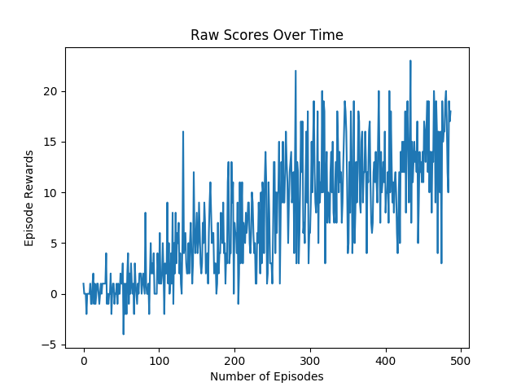
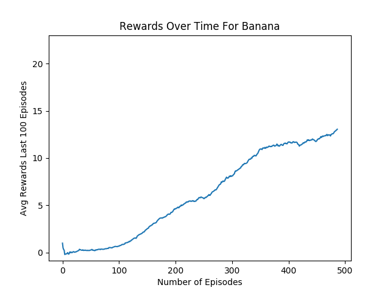

## An Implementation of DQN algorithm that solves Banana Collector Environment

## The Algorithm

For this project a Deep Q Network (DQN) algorithm was used. DQN is an off-policy algorithm which uses past experience to train neural net to approximate Q-Values. The Q-learning algorithm can be used to help agents learn how to solve simple environments with discrete state spaces, however it struggles to solve envinronments with continuous state spaces. Unlike the traditional Q-learning algorithms DQN can generalize high dimensional continuous state space well thanks to the function approximation using neural net.

One of the pitfalls of using neural net is that it requires a target value for the model to try to approximate. This can cause an issue with learning algorithms as we don't actually know exactly what that value is, we can only approximate with data. This leads to an issue where we are trying to approximate using approximation and one way to get around the issue is using fixed Q targets with a second neural net and updating the second model either after a certain number of observations or suing soft-updates to gradually change the model over time.

There have been many improvements made to the original DQN algorithm, but the implementation here uses the very basic model to solve this environment.

## Neural Network Model

The neural network model has 2 hidden layer with 64 nodes in each and uses relu activation function. Models with different number of layers (16, 32) and number of nodes (16, 32) were tested and I did not notice an increase in perfomance as the number of layers and nodes increased beyond 2 and 64 respectively. Different batch sizes (32, 64) were tested as well, but I did not notice a big difference in the performance of the agent. 

## Epsilon and Decay

DQN algorithm incorporates epsilon greedy algorithm to promote exploration of the environment so it's important to not decay epsilon too rapidly so that the agent can explore the environment sufficiently. Given that the environment is relatively simply, a decay of 0.99 worked quite well. Other higher values such as 0.999 and 0.995 were tested as well, but it seems to only delayed how fast the agent was able to beat the environment. 

## Hyperparameters

Below is a list of hyperparameters used for the final model. 

* Number of Hidden Layer: 2 
* Number of Nodes : 64
* Batch Size : 128
* Discount Factor = 0.9
* Update Frequency = 4
* Soft Update Rate = 0.001
* Loss Function = MSE
* Epsilon Decay Rate = 0.99
* Min Epsilon = 0.05

## Plots

Plots of the scores are included below. As one can see the algorithm converges nicely without much trouble. Given the simplicity of the environment and the goal, pickup yellow banana and avoid blue bananas, this is not a surprise. 

This specific agent solved the environment before 400 steps, and I've also managed to solve the environment before 300 steps using more augmentations used in the Rainbow model. 

## Ideas For Future Work

Below are some of the simplest ways to improve the DQN algorithm that I implemented. DQN algorithm is known to overestimate Q-values and it's been shown that double DQN algorithm improves the model learning quite bit. Instead of sampling past experiences randomly, Priority Replay samples past experiecnes based on a weight that is proportional to the absolute value of the loss between execpted Q value from the local model and the target Q value from the target model. This helps the model learn from unexpected or ill fitting expereinces which helps with learning to solve the environment quicker.

1) Double DQN
2) Priority Replay
